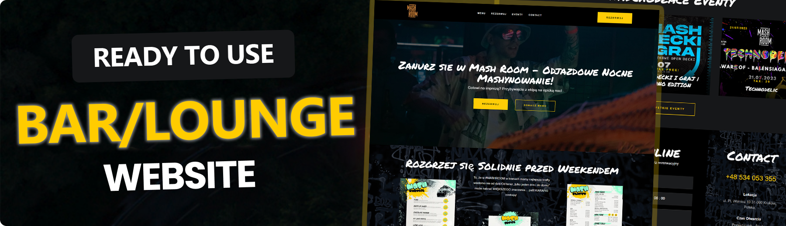

<div align="center">
  <br />
      
  <br />

  <h1 align="center">Local Bar / Lounge Website</h1><div>
    
    
    
  </div>
   <div align="center">
     A vibrant venue offering a unique nightlife experience with a focus on craft beers, cocktails, and pizza. Designed to entice visitors to enjoy bar/lounge offerings and participate in events.
    </div>
</div>

## 📋 <a name="table">Table of Contents</a>

1. 🤖 [Introduction](#introduction)
2. ⚙️ [Tech Stack](#tech-stack)
3. 🔋 [Features](#features)
4. 🤸 [Quick Start](#quick-start)

## <a name="introduction">🤖 Introduction</a>

The "Mash Room" website highlights a modern bar/lounge. It features a straightforward design that guides visitors through the website that includes sections for discovering the lounge's features, viewing upcoming events, the latest menu, exploring available services, and details on how to book a visit or reserve space for an event.

## <a name="tech-stack">⚙️ Tech Stack</a>

- React.js
- Tailwind CSS
- Next.js

## <a name="features">🔋 Features</a>

👉 **Beautiful tailored design**: The Mashroom site offers a dynamic and engaging user experience with smooth, subtle animations that draw visitors into the nightlife atmosphere.

👉 **Interactive Event Showcase**: Visitors can explore upcoming events through an interactive display, enhancing engagement and user interaction.

👉 **Completely Responsive**: Consistent access and optimal viewing on any device with a fully responsive design that adapts to different screen sizes.

and many more, including code architecture and reusability

## <a name="quick-start">🤸 Quick Start</a>

Follow these steps to set up the project locally on your machine.

**Prerequisites**

Make sure you have the following installed on your machine:

- [Git](https://git-scm.com/)
- [Node.js](https://nodejs.org/en)
- [npm](https://www.npmjs.com/) (Node Package Manager)

**Cloning the Repository**

```bash
git clone https://github.com/maxbezs/mash-room.git
cd mush-room
```

**Installation**

Install the project dependencies using npm:

```bash
npm install
```

**Running the Project**

```bash
npm run dev
```

Open [http://localhost:3000](http://localhost:3000) in your browser to view the project.

---
